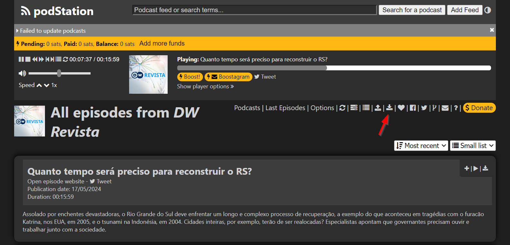

---
authors:
  - dellagustin
date: 2024-05-20
---
# The state and future of podStation with the transition to Chrome's Manifest V3

!!! warning "Didn't you open this page?"
    If you did not open this page, it was automatically opened by podStation when it upgraded. Sorry for the disturbance.

!!! note "TL;DR, Too long; Didn't read, Summary"
    I'm unlikely to finish the required updates on podStation in time, to keep it operational after July 2024. It may be disabled in your browser automatically as early as July 2024. I suggest that you download your list of subscribed podcasts and start getting familiar with other players. This page gives more information on how to do that.

Hello podStation users,

I'm sorry to carry bad news.

## What's happening?

If you read my previous post, [Upcoming changes that you should know](./2024-01-30-future.md) (Jan 30, 2024), you know that I've been working against the clock to update podStation to use the new Chrome Extensions Application Programming Interface (API), the so called Manifest V3, or MV3.

In June 2024 Chrome will start disabling the extensions using the current API (Manifest V2, or MV2) on pre-stable versions of Chrome (Dev, Canary and Beta) in Chrome version 127 and later[^manifest-v2-timeline].  
Around July, depending on the data they collect, they will start disabling it on the stable versions too[^manifest-v2-timeline].

**I have not been able to finish this update in time**, and I don't think I'll finish it until July, as there is still a lot to be done. Some of the reasons:

1. **Prioritizing personal life** - I love what I built with podStation and the idea of how many people use it on a daily basis to listen to their podcast. Nevertheless, the required updates take a lot of effort and I did not want to compromise other aspects of my personal life too much. This is voluntary work, and I have to take care of myself.
2. **Effects of my day job** - I consider that I have a very good work-life balance, when comparing myself to others. Nevertheless, although I hardly ever work more than 8h a day for my day job, it is still an intense and mentally tiring job, so I don't always have the energy to continue working on my hobby project.
3. **A recent unprecedented humanitarian crisis in the south of Brazil** - My homeland, the south of Brazil is suffering from unprecedented floods, which has **displaced more than 500.000 people** from their homes. Although I don't live there anymore, and my family is safe, this is still affecting me and my motivation quite a lot. Besides the sheer effect of the event, distracting me from tasks that require focus, I'm also spending some time trying to help remotely, as I'm maintaining the website <https://enchentesrs.github.io/how-to-help/> with information about the event.

## What should you do?

First and foremost, please don't give up on podStation, meaning, **don't uninstall it**. I plan to continue working on the update. Even if I don't finish it before it is disabled in your browser, I still plan to bring it "back to life" some time in the near future. It is always great for my motivation when you **leave a review for [podStation on the Chrome Web Store](https://chromewebstore.google.com/detail/podstation-podcast-player/bpcagekijmfcocgjlnnhpdogbplajjfn)**.

**Nevertheless, you should take precautions.**

I advise you to download your list of subscribed podcasts on podStation, so that you can import it on other players. To **download the list of subscribed podcasts**, use the _Export feeds to OPML file_, accessible from toolbar on podStation. Check the screenshot for a reference:

Aside from that, I recommend that you **start getting familiar with other podcast players**, as there is a big chance that you will need a replacement, at least temporarily. I recommend you to prioritize Free/Libre and Open Source players (see why in [Free/Libre and Open Podcasting - a conversation starter](https://dellagustin.github.io/podcasting/2023/07/13/free-libre-open-podcasting.html)), and here is where you can find a list of such players (and more): **[Podcast Index - Apps](https://podcastindex.org/apps?appTypes=open+source%2Cpodcast+player)**. If you use Android, **I can personally recommend [AntennaPod](https://antennapod.org/)**.

Lastly, **if you would like to keep informed** when podStation is back in action, in the event it gets disabled in your browser, follow it on any of these social media channels:

* :fontawesome-brands-mastodon: Mastodon - [@podStation@fosstodon.org](https://fosstodon.org/@podstation){:target="_blank"}
* :fontawesome-brands-twitter: Twitter - [@podStation_app](https://twitter.com/podStation_app){:target="_blank"}
* :fontawesome-brands-facebook: Facebook - [podStation](https://www.facebook.com/podStation){:target="_blank"}

[^manifest-v2-timeline]: Chrome for Developers, [Manifest V2 support timeline](https://developer.chrome.com/docs/extensions/develop/migrate/mv2-deprecation-timeline?hl=en){:target="_blank"}

## One ask to you

Although this does not increase the chance of me speeding things up in podStation, I would be very thankful to you if you could support the south of Brazil in this moment of humanitarian crisis. If podStation is, or was, valuable to you, and you ever wanted to give something back, this is a great way of doing that.

**I have collected means to help 💰💪 from abroad on the page <https://enchentesrs.github.io/how-to-help/>**.

If you cannot help financially, or you want to help some more, you can also help by spreading the word 📣, sharing the website with your network and/or re-posting🔁 the following social media posts:

* :fontawesome-brands-twitter: [Twitter](https://twitter.com/dellagustindev/status/1788845226045354330)
* :fontawesome-brands-facebook: [Facebook](https://www.facebook.com/dellagustin/posts/10220006574474004)
* :fontawesome-brands-linkedin: [LinkedIn](https://www.linkedin.com/posts/dellagustin_flood-in-the-south-of-brazil-rio-grande-activity-7194612518030397440-Di-W)
* :fontawesome-brands-mastodon: [Mastodon](https://fosstodon.org/@dellagustin/112415718420762619)