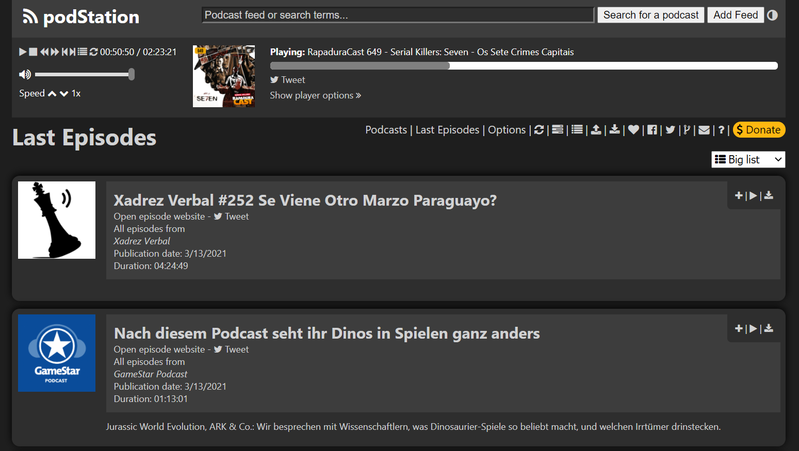

# Welcome to the home of podStation

podStation is an open source **podcast aggregator** packaged as a browser extension.

## Chrome Web Store

[INSTALL HERE][at-chrome-web-store]{ .md-button .md-button--primary }

[][at-chrome-web-store]
[][at-chrome-web-store]
[][at-chrome-web-store]

[at-chrome-web-store]: https://chrome.google.com/webstore/detail/podstation-podcast-player/bpcagekijmfcocgjlnnhpdogbplajjfn

## Screenshots

## Features

- **Find your podcasts:** Search for podcasts on podcastindex.org, iTunes and Digital Podcast
- **Subscribe**: Subscribe to the podcasts you want to listed, and find their episodes on podStation
- **Play:** Play podcasts directly in podStation, select your play
- **Playlist:** Add podcast episodes to your playlist
- **Synchronize across devices:** If you are signed in to Chrome, your list of podcasts, episode listening progress and settings will be synchronized across devices
- **Import/Export:** Import or export your subscriptions in OPML format

### Experimental

- **Value for value:** Pay value enabled podcasts while you listen, using bitcoins and the lightning network (support for [LND](https://github.com/podStation/podStation/blob/master/docs/release_notes/v1.33.0.md) nodes and [LNPay](https://github.com/podStation/podStation/blob/master/docs/release_notes/v1.34.0.md))